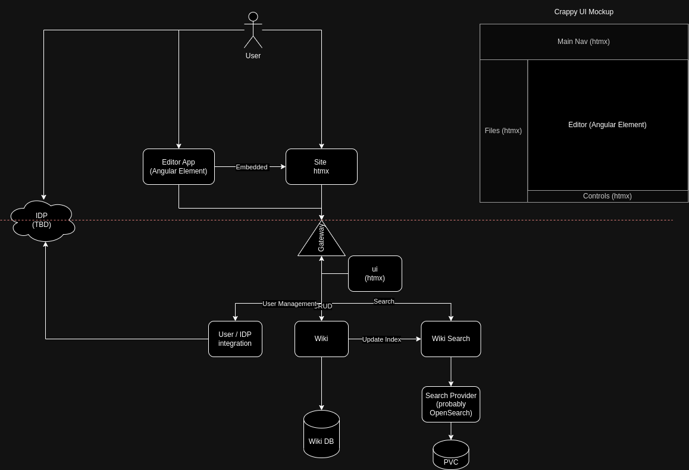

[Back](../README.md)
### System Design 

Napkin sketch of the system design.

### UI Design 
I've created some concepts for the basic layout of the UI.

[Page Designs](./page_design_concept.pdf)

The UI will use a color palette to allow for easy switching of themes.
So far these are the colors that comprise the palette. More to be added.

- Background 
- Background - Raised 
- Background - Raised 2 
- Surface 
- Focus 
- Active 
- Primary

[Back](../README.md)

